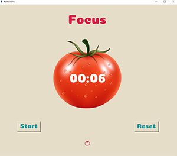

## Pomodoro Technique program:

### Introduction:

This project is a Python tkinter practice, as we configure this program base on Pomodoro technique, and it is about 
productivity and avoiding procrastination, by attending four session of work, and between each session and the next one there is a short break between them.
After four session done you will get a long break.
#### for more check [Pomodoro Technique ](https://en.wikipedia.org/wiki/Pomodoro_Technique)
